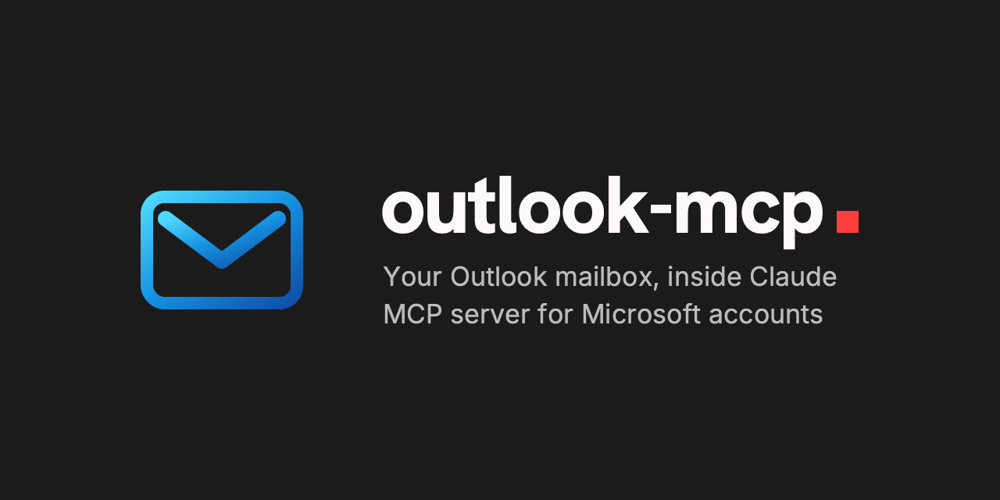

<p align="center"></p>

A [Model Context Protocol](https://modelcontextprotocol.io) server that lets Claude (and any MCP client) read, search, send and organize your **Outlook / Microsoft 365 / Outlook.com** mail through the Microsoft Graph API.

---

## 🔭 Overview

`outlook-mcp` runs locally over stdio. It signs in with the **OAuth device code flow** (no client secret, no redirect URI), stores the refresh token in a local file only you can read, and talks to Microsoft Graph with plain `fetch`.

## ✨ Features

- 📂 Browse folders, list and search messages (KQL), read bodies as sanitized plain text
- 📎 List and download attachments safely into a configured directory
- ✉️ Send mail, create drafts, reply, reply-all and forward (local attachments under 3 MB)
- 🗂️ Move, mark read/unread, flag and delete messages
- 🔒 Read-only mode that removes every mutating tool
- 🔁 Automatic retry with `Retry-After` / exponential backoff for throttling (429/503/504)
- 🧾 Logs only to stderr; never logs tokens or message bodies

## 📋 Requirements

- Node.js **24 (LTS) or newer**
- A Microsoft account (personal, work or school)
- An Azure app registration (free, see below)

## 🏗️ Azure app registration (step by step)

1. Open [portal.azure.com](https://portal.azure.com) and go to **Microsoft Entra ID** -> **App registrations** -> **New registration**.
2. Give it a name (for example `outlook-mcp`).
3. Under **Supported account types** choose:
   - **Personal Microsoft accounts only** (Outlook.com, Hotmail, Live), or
   - **Accounts in any organizational directory and personal Microsoft accounts** (both).
   - For work/school only, pick an organizational option.
4. Leave **Redirect URI** empty and click **Register**.
5. In the left menu go to **Manage** -> **Authentication** -> **Settings** tab, set **Allow public client flows** to **Yes** and save.
6. Go to **Manage** -> **API permissions**. `User.Read` is already granted by default. Click **Add a permission** -> **Microsoft Graph** -> **Delegated permissions** and add:
   - 📬 Expand the **Mail** group and tick `Mail.ReadWrite` and `Mail.Send`.
   - 🔑 Expand the **OpenId permissions** group and tick `offline_access`.

   Then click **Add permissions**. No admin consent is needed for personal accounts.

> 💡 The Azure portal may be shown in your language, so labels can differ slightly (e.g. *Administrar* -> *Autenticación* -> *Configuración*, *Permisos de OpenId*).
7. From the **Overview** page copy the **Application (client) ID**. This is your `OUTLOOK_CLIENT_ID`.

> 🏢 **Work or school accounts:** set `OUTLOOK_TENANT=organizations` (or your tenant GUID). Your organization may require **admin consent** for the mail permissions.

## 🚀 Installation

```bash
git clone <your-fork-or-this-repo-url> outlook-mcp
cd outlook-mcp
npm install
cp .env.example .env        # then set OUTLOOK_CLIENT_ID in .env
npm run build
npm run auth                # follow the device code instructions
npm run whoami              # verify the sign-in
```

## ⚙️ Configuration (`.env`)

Variables are read from `.env` in the current directory and in the package directory (so launching with an absolute path works from anywhere). Real environment variables override `.env`.

| Variable | Default | Description |
| --- | --- | --- |
| `OUTLOOK_CLIENT_ID` | _(required)_ | Application (client) ID of your Azure app registration. |
| `OUTLOOK_TENANT` | `consumers` | Authority tenant: `consumers` (personal), `organizations` (work/school), `common` (both) or a tenant GUID. |
| `OUTLOOK_SCOPES` | `User.Read Mail.ReadWrite Mail.Send offline_access` | Space-separated delegated Graph scopes requested at sign-in. |
| `OUTLOOK_TOKEN_CACHE` | `~/.config/outlook-mcp/token-cache.json` | Where the MSAL token cache is stored (file mode `0600`). |
| `OUTLOOK_READ_ONLY` | `false` | When `true`, send/move/delete/flag/mark tools are not registered at all. |
| `OUTLOOK_DOWNLOAD_DIR` | `~/Downloads` | The only directory attachments may be written to. |
| `OUTLOOK_DEFAULT_TOP` | `20` | Default page size for list/search tools (1-100). |
| `OUTLOOK_MAX_BODY_CHARS` | `20000` | Maximum body characters returned by `get_message`. |
| `OUTLOOK_GRAPH_BASE_URL` | `https://graph.microsoft.com/v1.0` | Graph endpoint (change for national clouds). |
| `LOG_LEVEL` | `info` | `debug`, `info`, `warn` or `error` (written to stderr). |

## 🔐 Authentication

```bash
npm run auth      # device code sign-in; prints a URL and a code to stderr
npm run whoami    # silent token + GET /me
npm run logout    # removes accounts and deletes the token cache file
```

The server itself never prompts. If the session is missing or expired, tools return: *"Not signed in or session expired. Run `npm run auth` ..."*. Run it in a terminal and retry.

## 🤖 Using with Claude

### Claude Code

```bash
claude mcp add outlook --scope user -- node /absolute/path/outlook-mcp/dist/index.js

# or pass settings explicitly instead of relying on .env
claude mcp add outlook --scope user \
  -e OUTLOOK_CLIENT_ID=your-client-id \
  -e OUTLOOK_TENANT=consumers \
  -- node /absolute/path/outlook-mcp/dist/index.js
```

### Claude Desktop

Add to `claude_desktop_config.json`:

```json
{
  "mcpServers": {
    "outlook": {
      "command": "node",
      "args": ["/absolute/path/outlook-mcp/dist/index.js"],
      "env": {
        "OUTLOOK_CLIENT_ID": "your-client-id",
        "OUTLOOK_TENANT": "consumers"
      }
    }
  }
}
```

Restart Claude Desktop afterwards. Use `npm run inspect` to try the tools in the MCP Inspector.

## 🧰 Tools reference

| Tool | Mutating | Description |
| --- | :---: | --- |
| `list_folders` | no | List mail folders or child folders (`parentFolderId`, `includeHidden`). |
| `list_messages` | no | List messages, newest first, with filters (`unreadOnly`, `from`, `since`, `until`, `hasAttachments`) and `nextLink` paging. |
| `search_messages` | no | KQL full-text search with `nextLink` paging. |
| `get_message` | no | Full message with recipients, flags and body (`format` text/html, `maxChars`). |
| `list_attachments` | no | Attachment metadata for a message. |
| `download_attachment` | no | Save an attachment into `OUTLOOK_DOWNLOAD_DIR` (writes locally only; no overwrite unless `overwrite: true`). |
| `send_mail` | yes | Send an email, optionally with local attachments under 3 MB. |
| `create_draft` | yes | Create a draft without sending. |
| `reply_message` | yes | Reply or reply-all (`replyAll`). |
| `forward_message` | yes | Forward to new recipients. |
| `move_message` | yes | Move to a folder; returns the new id. |
| `mark_read` | yes | Mark read or unread. |
| `get_unsubscribe_info` | no | Show how to leave the mailing list a message came from (List-Unsubscribe). |
| `unsubscribe` | yes | Leave a mailing list: RFC 8058 one-click, else a mailto request, else returns the link. |
| `flag_message` | yes | `flagged`, `complete` or `notFlagged`. |
| `delete_message` | yes | Move to Deleted Items, or `permanent: true` to delete irreversibly. |

Well-known folder names accepted anywhere a folder id is expected: `inbox`, `drafts`, `sentitems`, `deleteditems`, `junkemail`, `archive`.

## 👁️ Read-only mode

Set `OUTLOOK_READ_ONLY=true` to register only the non-mutating tools. The mutating tools do not exist for the client, so they cannot be called at all. Combine it with a token cache created using only `User.Read Mail.Read` (set `OUTLOOK_SCOPES` accordingly and re-run `npm run auth`) for defense in depth.

## 🛡️ Security

- 🔑 The token cache is stored locally with mode `0600` in a `0700` directory, written atomically.
- 🙅 No client secret exists: this is a public client using device code flow.
- 🤐 Tokens and message bodies are never logged; MSAL PII logging is disabled.
- 📥 Attachment downloads are confined to `OUTLOOK_DOWNLOAD_DIR`; path traversal is rejected.
- ⚠️ `delete_message` with `permanent: true` is **irreversible**, and `send_mail`, `reply_message` and `forward_message` send immediately. Prefer read-only mode or `create_draft` when in doubt.
- 🧠 Email content is untrusted input: a malicious message may try to instruct the model (prompt injection). Review actions that send or delete.

## 🩺 Troubleshooting

| Symptom | Fix |
| --- | --- |
| `AADSTS7000218` (client assertion / secret required) | Enable **Allow public client flows** in Azure -> Manage -> Authentication -> Settings. |
| `AADSTS50020` or wrong tenant | The account type does not match `OUTLOOK_TENANT`. Use `consumers` for personal, `organizations` for work/school, `common` for both, and make sure the app registration supports that account type. |
| "Not signed in or session expired" | Run `npm run auth` again. |
| Search returns "Invalid search query" | `search_messages` uses KQL, e.g. `from:alice subject:"report" hasattachments:true`. Graph returns at most about 250 results per search, and results are not sorted. |
| "Message not found" after a move | Message ids change when a message is moved. Use the `newId` returned by `move_message` or list the folder again. |
| Access denied / consent required | Add the missing delegated permission, or ask an admin for consent. |
| Server does not start in a client | Check stderr logs; `OUTLOOK_CLIENT_ID` must be set via `.env` or the client's `env` block. |

## 🗺️ Roadmap

- 📅 Calendar support (`Calendars.ReadWrite`)
- 📦 Large attachments through upload sessions
- 👥 Contacts

## 🤝 Contributing

Issues and pull requests are welcome.

```bash
npm install
npm run typecheck
npm test
npm run build
```

Please keep code, comments and docs in English, add tests for new behavior, and never log secrets or message content.

## 📄 License

[MIT](LICENSE)
